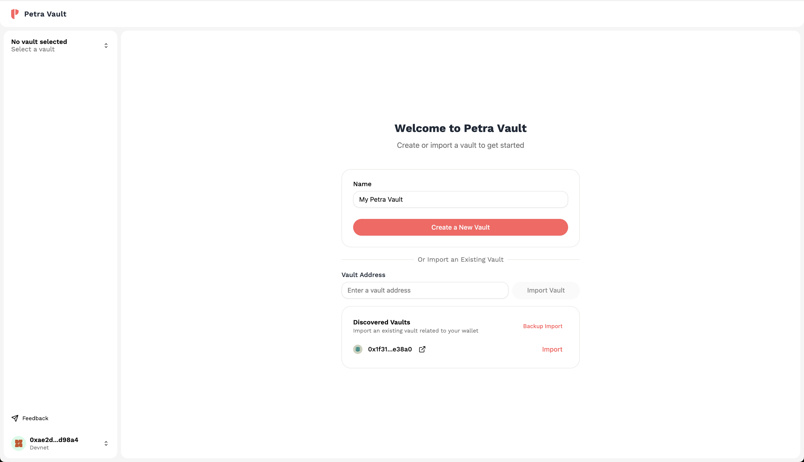
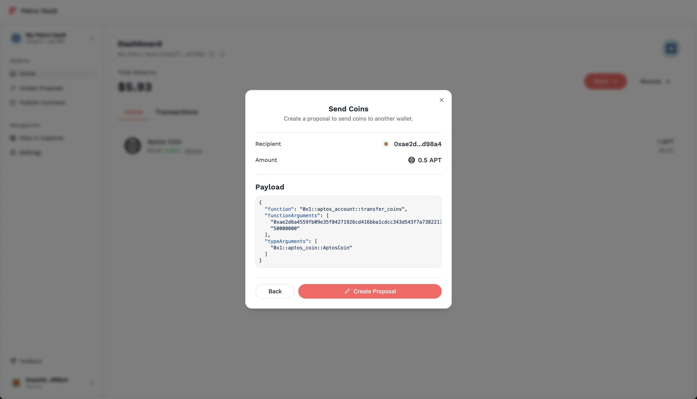
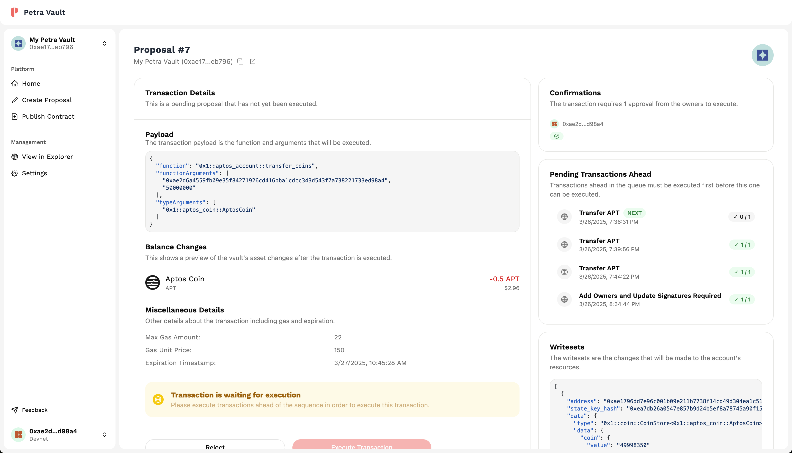
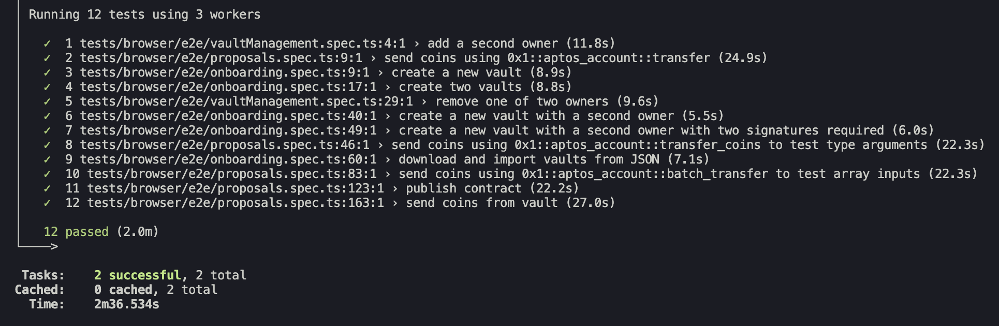

<p align="center">
  <a href="https://vault.petra.app">
    
  </a>
</p>

<p align="center" style="font-size: 24px; font-weight: bold;">
<b>
  Petra Vault
</b>
</p>
<p align="center">
  Multisig wallet solution on the Aptos blockchain
</p>

<div align="center">
   <a href="https://github.com/aptos-labs/petra-vault/blob/main/LICENSE">
      
   </a>
</div>

---

### Features

Petra Vault enables you to create and manage multisig vaults on the Aptos blockchain.

<p>
   <b>Create or Import Vaults</b>: Quickly create a new vault or import an existing one (including those created from other platforms).
</p>
<div style="border-radius: 8px; overflow: hidden; box-shadow: 0 0 10px 0 rgba(0, 0, 0, 0.1); width: 50%; margin: 0 auto;">
   
</div>

<br/>

<p>
   <b>Proposal Presets</b>: Packed with presets with seamless experiences for common transactions (e.g. sending coins, adding/removing owners, publishing modules, etc.)
</p>

<div style="border-radius: 8px; overflow: hidden; box-shadow: 0 0 10px 0 rgba(0, 0, 0, 0.1); width: 50%; margin: 0 auto;">
   
</div>

<br/>

<p>
   <b>Transaction Simulations</b>: Preview the effects of transactions before sending them.
</p>

<div style="border-radius: 8px; overflow: hidden; box-shadow: 0 0 10px 0 rgba(0, 0, 0, 0.1); width: 50%; margin: 0 auto;">
   
</div>

<br/>

And that's not it, explore the rest of the features yourself at [vault.petra.app](https://vault.petra.app)!

## Documentation

For documentation, please refer to the [petra.app/vault](https://petra.app/vault).

## Getting Started

### Prerequisites

- Node.js
- pnpm

Runtime versions are defined in the [`.tool-versions`](../.tool-versions) file. You can install these runtimes using [mise](https://mise.jdx.dev/).

### Installation

1. Clone the repository:

   ```bash
   git clone https://github.com/aptos-labs/petra-vault.git
   cd petra-vault
   ```

2. Install dependencies:

   ```bash
   pnpm install
   ```

3. Start the development server:

   ```bash
   pnpm dev
   ```

4. Open [http://localhost:3000](http://localhost:3000) in your browser to see the application.

### Environment Variables

Create a `.env.local` file in the `apps/web` directory by copying the example file:

```bash
cp .env.example .env.local
```

Required environment variables:

```bash
# Enable React performance scanning
NEXT_PUBLIC_ENABLE_REACT_SCAN=0

# API Keys for Aptos networks (obtain from https://developers.aptos.dev)
NEXT_PUBLIC_APTOS_MAINNET_API_KEY=<api_key>
NEXT_PUBLIC_APTOS_TESTNET_API_KEY=<api_key>

# Google Analytics ID (obtain from https://analytics.google.com)
NEXT_PUBLIC_GA4_ID=<ga4_id>

CI=false
```

> **Note**: Make sure to obtain the necessary API keys from the provided links to avoid rate limiting issues.

## Testing

The monorepo uses [vitest](https://vitest.dev/) for unit testing and [playwright](https://playwright.dev/) for end-to-end testing.

### Unit Tests

To run the unit tests, you can use the following command:

```bash
pnpm test
```

### End-to-End (E2E) Tests

To get started with E2E tests, you must first install the Playwright dependencies:

```bash
pnpx playwright install --with-deps chromium
```

Then, you can run the E2E tests using the following command:

```bash
pnpm test:e2e
```



> **Note**: Running it from the root directory will automatically do any necessary builds steps. If done in a subdirectory, make sure to manually build the project using `pnpm build` before running the tests.

## Deployments

The deployment points to [https://vault.petra.app](https://vault.petra.app). The application is deployed onto [Vercel](https://vercel.com) using the `main` branch. Deployments are automatically triggered when a push is made to the `main` branch.

## Contributing

Contributions are welcome! Please refer to the [CONTRIBUTING.md](./CONTRIBUTING.md) file for more information.
